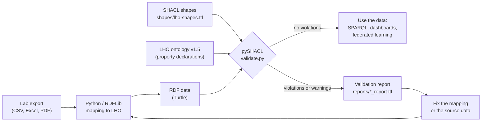
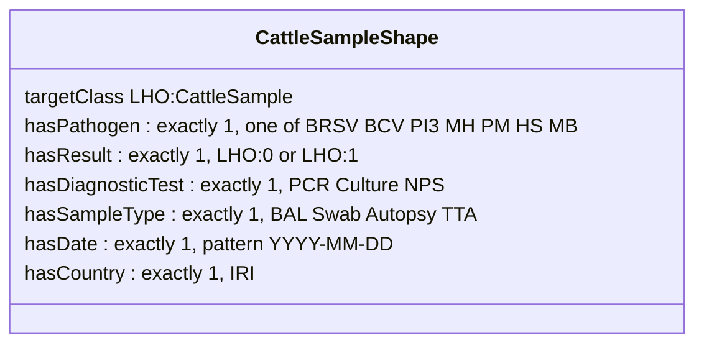

# SHACL validation of LHO-mapped laboratory data

This repository contains SHACL shapes that check whether laboratory data mapped to the [Livestock Health Ontology (LHO)](https://github.com/decide-project-eu/LivestockHealthOntology) are complete and consistent before they are combined, queried with SPARQL or shown in a dashboard.

I developed the LHO in the EU Horizon 2020 project [DECIDE](https://decideproject.eu/) to describe diagnostic data from veterinary laboratories in one shared model. The data come from different
laboratories and countries, and each laboratory exports its data in its own way. Mapping to the ontology gives the data a common meaning, but it does not guarantee that every record is complete or written in the same format. SHACL is used here for that second step.

The shapes cover four use cases:

| Use case                                         | LHO class             | Source of the RDF structure |
| ------------------------------------------------ | --------------------- | --------------------------- |
| Cattle, bovine respiratory disease (7 pathogens) | `LHO:CattleSample`  | Cattle Barometer            |
| Pigs, respiratory and enteric pathogens          | `LHO:PigSample`     | Pig Barometer               |
| Poultry, infectious bronchitis virus genotypes   | `LHO:PoultrySample` | Poultry Barometer           |
| Salmon, monthly mortality and biomass reports    | `LHO:SalmonSample`  | Scottish salmon use case    |

## How it works



Each record (sample) in the data is a *focus node*. For every class there is a node shape, and each node shape has property shapes that say which properties a sample must have, how many values, and which values are allowed. pySHACL checks every sample against its shape and writes a report with one result per problem.

Results have two severity levels:

- **Violation**: the record cannot be used as it is (for example no test result, or a date that cannot be read).
- **Warning**: the record can be used, but a value needs attention (for example province "nan", left over from the conversion).

## The shapes

### Cattle sample shape



### All shapes

| Shape                     | Target                | What it checks                                                                                                                                                 | Severity  |
| ------------------------- | --------------------- | -------------------------------------------------------------------------------------------------------------------------------------------------------------- | --------- |
| `CattleSampleShape`     | `LHO:CattleSample`  | one of the seven BRD pathogens, one result (0/1), one diagnostic test, one sample type, one ISO date, one country                                              | Violation |
| `PigSampleShape`        | `LHO:PigSample`     | one pig pathogen, one result (0/1), one diagnostic test, at most one production stage, one ISO date, one country                                               | Violation |
|                           |                       | sample type is one of the LHO sample type classes                                                                                                              | Warning   |
| `PoultrySampleShape`    | `LHO:PoultrySample` | one IBV genotype from the Poultry Barometer list (or "other"), one result, one production stage, one sample type, date as YYYY-MM-DD or YYYY-Qn                | Violation |
| `SalmonSampleShape`     | `LHO:SalmonSample`  | one mortality value (`LHO:CS58`, hasMortality), one biomass value, water type Seawater or Freshwater, at most one local authority, one ISO date, one country | Violation |
| `PlaceholderValueShape` | cattle, pig, poultry  | province, breed and production stage are not "nan". "Missing" and "Unknown" are accepted, because they are explicit categories in the barometer data           | Warning   |
| `DeclaredPropertyShape` | all four              | every LHO property used in the data is declared in the ontology (SPARQL-based constraint)                                                                      | Warning   |

## Example: from data to report

The folder `examples/` has a few synthetic records per use case. They follow the same structure as
the DECIDE data. `ideal_example.ttl` has one complete record per use case and passes every check.
The other files contain problems on purpose. Real laboratory data are not included in this repository.

**1. The data.** `LHO:ExampleCattleSample_3` has a date written as day/month/year:

```turtle
LHO:ExampleCattleSample_3 a LHO:CattleSample ;
    LHO:hasPathogen LHO:PM ;
    LHO:hasResult LHO:0 ;
    LHO:hasDiagnosticTest LHO:NPS ;
    LHO:hasSampleType LHO:BAL ;
    LHO:hasDate <http://www.purl.org/decide/LiveStockHealthOnto/LHO#08/06/2022> ;
    LHO:hasCountry LHO:Belgium ;
    LHO:hasProvince LHO:nan ;
    LHO:hasBreed LHO:Unknown .
```

**2. The rule.** The cattle shape asks for one date in ISO format:

```turtle
sh:property [
    sh:path LHO:hasDate ; sh:minCount 1 ; sh:maxCount 1 ;
    sh:pattern "#[0-9]{4}-[0-9]{2}-[0-9]{2}$" ;
    sh:message "One date is required, written as an ISO date (YYYY-MM-DD), so that data from different labs can be combined." ] ;
```

**3. The result.** pySHACL reports the problem, the sample and the value:

```turtle
[] a sh:ValidationResult ;
    sh:focusNode LHO:ExampleCattleSample_3 ;
    sh:resultPath LHO:hasDate ;
    sh:value <http://www.purl.org/decide/LiveStockHealthOnto/LHO#08/06/2022> ;
    sh:resultSeverity sh:Violation ;
    sh:sourceConstraintComponent sh:PatternConstraintComponent ;
    sh:resultMessage "One date is required, written as an ISO date (YYYY-MM-DD), so that data from different labs can be combined." .
```

The same sample also gets a warning, because its province is "nan". Its breed "Unknown" is accepted.

### Results on the example files

| File                    | Samples | Problems planted                                                                        | Violations | Warnings |
| ----------------------- | ------- | --------------------------------------------------------------------------------------- | ---------- | -------- |
| `ideal_example.ttl`   | 4       | none (one complete record per use case)                                                 | 0          | 0        |
| `cattle_example.ttl`  | 5       | date format, missing result, pathogen outside the BRD list, two results, province "nan" | 4          | 1        |
| `pig_example.ttl`     | 4       | missing result, sample type outside the LHO classes, two production stages              | 2          | 1        |
| `poultry_example.ttl` | 4       | genotype "4/91" converted to "491", missing production stage, unreadable date           | 3          | 0        |
| `salmon_example.ttl`  | 4       | missing mortality, water type "sea", two local authorities, missing date                | 4          | 0        |

The ideal records pass with no violations and no warnings, and every planted problem is found.
The full output is in `reports/summary_examples.txt`, and the full SHACL reports are in `reports/`.

### What the validation showed about the ontology itself

The `DeclaredPropertyShape` checks that every LHO property used in the data is declared in the
ontology. Run against the earlier LHO version (v1.4), it warned on three properties used by the mapping scripts:
`LHO:hasResult`, `LHO:hasProductionStages` and `LHO:CS61`. I fixed this in LHO v1.5 (included in `ontology/`):

- `LHO:hasResult` is now declared, as a subproperty of `LHO:hasSampleResult`.
- `LHO:hasProductionStages` is now declared, with range `LHO:LivestockProductionStages`.
- the class name `LivestockProductionSatges` was corrected to `LivestockProductionStages`.
- `LHO:CS61` is a lab reference individual in the ontology, so salmon mortality is linked with the
  declared property `LHO:CS58` (hasMortality).

With v1.5 these warnings no longer appear. This is a good example of how SHACL helps to keep the
ontology and the data that use it in line.

## How to run it

```bash
pip install -r requirements.txt

# validate the example files (ideal, cattle, pig, poultry, salmon)
python validate.py

# validate your own LHO-mapped RDF files
python validate.py path/to/your_data.ttl
```

On Windows PowerShell, put the path in quotes: `python validate.py "C:\Users\you\data\file.ttl"`.

For each file the script prints a summary (number of samples, violations and warnings, grouped by
message) and writes the full SHACL report to `reports/<file>_report.ttl`.

## Files

```
shapes/lho-shapes.ttl          SHACL shapes (node shapes, property shapes, one SPARQL constraint)
examples/ideal_example.ttl     one complete record per use case, passes all checks
examples/*_example.ttl         synthetic records for cattle, pig, poultry and salmon, with planted problems
ontology/LivestockHealthOntology_v1.5.rdf   LHO v1.5
validate.py                    runs pySHACL and summarises the report
reports/                       validation reports of the example files
```

## Related work

- Livestock Health Ontology: https://github.com/decide-project-eu/LivestockHealthOntology
- Noor, S., Bokma, J., Pardon, B., van Schaik, G., Hostens, M., 2024. Agri Semantics: developments to improve data interoperability to support farm information management and decision support systems in agriculture. Burleigh Dodds Science Publishing. https://doi.org/10.19103/AS.2023.0132.05
- Noor, S. et al., 2026. From data silos to actionable insights: a comparative evaluation of data access models and practical guidelines for animal health surveillance. Frontiers in Veterinary Science. https://doi.org/10.3389/fvets.2026.1962800

## License

The code (`validate.py`) is released under the MIT License (see `LICENSE`). The SHACL shapes and
example data are released under CC BY 4.0.

## Author

Saba Noor, Ghent University.

The DECIDE project received funding from the European Union's Horizon 2020 research and innovation
programme under grant agreement No 101000494.
